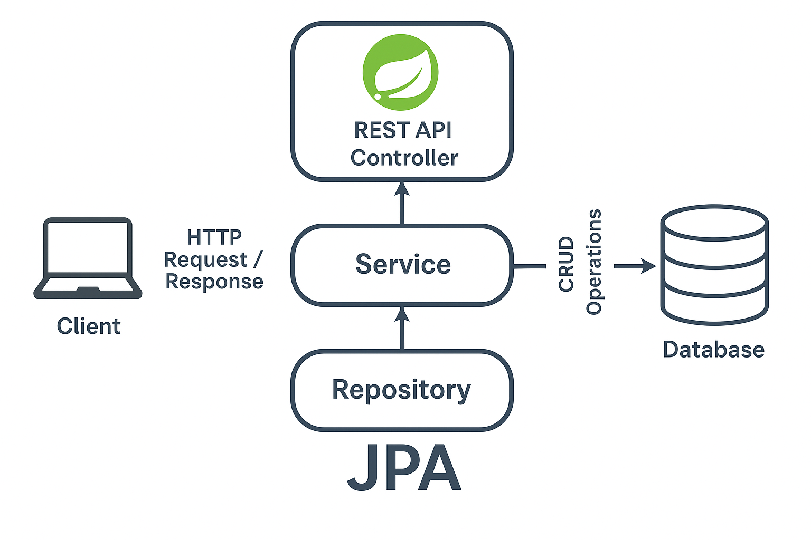

# 📚 Library Management REST API

This project is a **RESTful API** built with **Spring Boot** and **MySQL/PostgreSQL**, designed to manage a library's book inventory. It provides endpoints to perform **CRUD operations**—Create, Read, Update, and Delete—on book records.

The application follows a clean architecture with clear separation of concerns using **Controller-Service-Repository** layers, making it scalable, maintainable, and production-ready.

---

## 🚀 Features

- ✅ Add new books to the library
- ✏️ Update book details (title, author, availability, etc.)
- ❌ Delete existing entries from the database
- 🔍 Retrieve full information on all or specific books
- 🔄 RESTful API architecture for seamless integration with any frontend

---

## 🛠️ Technologies Used

- **Java** – The core programming language used to implement the API.
- **Spring Boot** – For building production-grade RESTful services with minimal configuration.
- **Spring Web** – For building the REST API endpoints.
- **Spring Data JPA** – For easy database interaction using repository interfaces.
- **MySQL / PostgreSQL** – For relational data storage. You can switch between them based on preference.
- **Lombok** – For reducing boilerplate code (getters/setters, constructors).
- **Maven** – For project build and dependency management.

---

## 🧪 API Endpoints

| Method | Endpoint             | Description                      |
|--------|----------------------|----------------------------------|
| GET    | `/api/books`         | Get all books                    |
| GET    | `/api/books/{id}`    | Get book by ID                   |
| POST   | `/api/books`         | Add a new book                   |
| PUT    | `/api/books/{id}`    | Update an existing book          |
| DELETE | `/api/books/{id}`    | Delete a book from the library   |

---
## 🛠 Setup Instructions

### Prerequisites
- Java 17+
- Maven
- MySQL
- IDE like IntelliJ or Eclipse

## 🧰 Getting Started
```bash

# Clone the repository
git clone git@github.com:TaranaGit/RestApi_SpringBoot_MySQL.git
cd RestApi_SpringBoot_MySQL

# Build the project
mvn clean install

# Run the application
mvn spring-boot:run
```

### System Architecture Diagram



